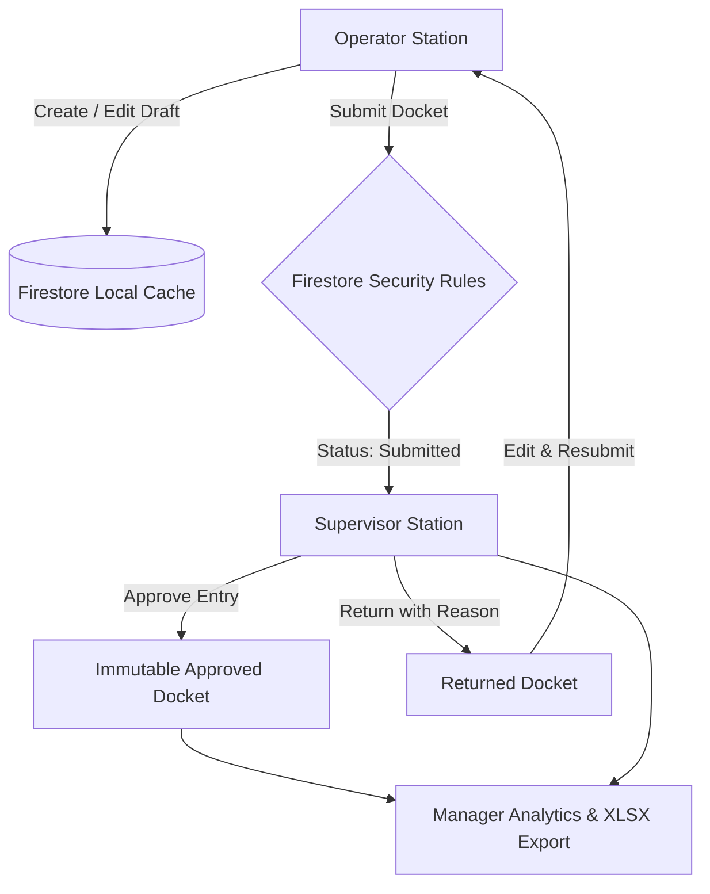

<div align="center">

# 🏭 Pallavan Precision Works
### Precision Shift Production Entry & Machine-Shop Docket System

<a href="https://git.io/typing-svg">
  
</a>

<br/>
<br/>

[](#)

<br/>

[](https://react.dev/)
[](https://www.typescriptlang.org/)
[](https://vitejs.dev/)
[](https://firebase.google.com/)
[](#offline-persistence--conflict-resolution)
[](#excel-export-specification)

</div>

---

## 📌 Executive Summary

**Pallavan Precision Works (PPW)** is a high-precision CNC and automotive component fabrication facility. Previously, machine bay operators tracked hourly production metrics on printed physical dockets. Arithmetic errors, lost sheets, delayed defect reporting, and manual data transcription into spreadsheets led to severe operational lag.

The **Production Docket System** replaces paper records with a glove-friendly, offline-first digital docket interface built for rugged shop-floor tablets. It introduces:
1. **Real-time automated math engine** for accepted quantities, rejection rates, and planned vs. actual achievement.
2. **Deterministic ID locking** (`machine_date_shift_hourSlot`) preventing duplicate entries.
3. **Hard enforcement of shop-floor quality rules** (e.g., mandatory remarks whenever rejections exceed 10.0%).
4. **Physical ink-stamp aesthetic and stack-light telemetry** for immediate visual feedback.
5. **Three-tier role separation** enforced directly in Firestore Security Rules.

---

## ⚡ Interactive System Pipeline

The lifecycle of every hourly production slot passes through four hardened stages:

[](#)

---

## 🚦 Physical Machine Stack-Lights & Visual States

Taking direct inspiration from industrial machine beacons (Patlite / Andon towers), every docket displays real-time operational status through animated stack-lights and tactile ink stamps:

[](#)

| Docket State | Stack-Light Beacon | Physical Ink Stamp | Edit Permissions | Transition Triggers |
| :--- | :--- | :--- | :--- | :--- |
| **`draft`** | 🟡 Pulsing Amber | `IN-PROGRESS` | Operator Only | Initial save by Operator |
| **`submitted`** | 🔵 Solid Blue | `QUEUED FOR AUDIT` | Locked (Read-Only) | Submitted by Operator to Supervisor |
| **`approved`** | 🟢 Radiant Emerald | `VERIFIED &amp; APPROVED` | Fully Locked | Signed off by Shift Supervisor |
| **`returned`** | 🔴 Alert Ruby | `ACTION REQUIRED` | Operator Only | Returned by Supervisor with mandatory note |

---

## 🔐 Role-Based Access Control (RBAC)

Permissions are strictly enforced at the **Firestore Security Rules layer** (`firestore.rules`), not merely hidden in the user interface.



### Authorization Matrix

| Operational Capability | 👷 Operator | 👨‍💼 Supervisor | 📊 Plant Manager |
| :--- | :---: | :---: | :---: |
| **Create Hourly Entry** | ✅ | ❌ | ❌ |
| **Edit Own Draft / Returned** | ✅ | ❌ | ❌ |
| **Edit Other Operator's Draft** | ❌ (Blocked by Rules) | ❌ | ❌ |
| **Submit Entry for Review** | ✅ | ❌ | ❌ |
| **View Other Operators' Entries** | ❌ (Own entries only) | ✅ (All plant bays) | ✅ (Read-only plantwide) |
| **Approve Entry** | ❌ | ✅ | ❌ |
| **Return Entry (w/ Mandatory Remark)** | ❌ | ✅ | ❌ |
| **Direct Excel (.xlsx) Export** | ❌ | ✅ | ✅ |

---

## 🧪 Pre-Configured Test Credentials

The local seed script (`npm run seed`) provisions 6 factory personas across 3 functional tiers:

| Role | Email | Password | Assigned Bay / Privileges |
| :--- | :--- | :--- | :--- |
| **Operator 1** | `operator1@ppw.local` | `operator123` | CNC Milling Bay 01 & Lathe 02 |
| **Operator 2** | `operator2@ppw.local` | `operator123` | Grinding Cell 03 & VMC 04 |
| **Supervisor 1** | `supervisor1@ppw.local` | `super123` | Shift A & B Floor Inspection |
| **Supervisor 2** | `supervisor2@ppw.local` | `super123` | Shift C Floor Inspection |
| **Plant Manager 1** | `manager1@ppw.local` | `manager123` | Plant Operations & QA Audits |
| **Plant Manager 2** | `manager2@ppw.local` | `manager123` | Production Planning & Dispatch |

---

## 📐 Formulas, Validations & Edge Case Rules

### 1. Mathematical Formulas
$$\text{Accepted Quantity} = \text{Total Produced} - \text{Rejected Quantity}$$

$$\text{Rejection Percentage} = \begin{cases} 0.0\% & \text{if } \text{Total Produced} = 0 \\ \left(\frac{\text{Rejected Quantity}}{\text{Total Produced}} \times 100\right) & \text{if } \text{Total Produced} > 0 \end{cases}$$

$$\text{Achievement Percentage} = \begin{cases} \text{—} & \text{if } \text{Planned Quantity} = 0 \\ \left(\frac{\text{Total Produced}}{\text{Planned Quantity}} \times 100\right) & \text{if } \text{Planned Quantity} > 0 \end{cases}$$

*Rounding Standard: Round-half-up to 1 decimal place (`Math.round(val * 10) / 10`).*

### 2. The 10.0% Rejection Threshold Rule
- If $\text{Rejection } \% > 10.0\%$, the UI and Firestore rules **mandate** an explanation in `rejectionRemarks`.
- Submissions exceeding 10.0% without a remark are rejected both by client-side validation and database rules.

### 3. Rejection Reason Taxonomy
To eliminate unparsed handwriting, rejection reasons are strictly bound to an industrial enum:
- `Dimensional deviation`
- `Surface finish defect`
- `Burr / Flash formation`
- `Material defect / Porosity`
- `Tooling / Setup error`
- `Other (Specified in remarks)`

### 4. Shift Midnight Crossing (Shift C)
- **Shift A**: `06:00 – 14:00`
- **Shift B**: `14:00 – 22:00`
- **Shift C**: `22:00 – 06:00` *(Crosses midnight)*
- **Manufacturing Standard**: Hours between `00:00` and `06:00` during Shift C are timestamped with the date on which the shift commenced, preserving uninterrupted 8-hour batch reporting.

---

## 📡 Offline Persistence & Conflict Resolution

In a busy machine bay surrounded by high-voltage equipment and metal shielding, Wi-Fi connectivity drops frequently.

### How Offline Mode Works
1. **Firestore IndexedDB Cache**:
   - The application mounts Firestore with local persistence (`enableIndexedDbPersistence`).
   - When offline, operators can create and modify drafts seamlessly.
2. **Optimistic UI & Pending Writes**:
   - The UI inspects `snapshot.metadata.hasPendingWrites`.
   - Any entry queued in the browser's local cache displays a prominent amber badge: `PENDING SYNC (OFFLINE)`.
3. **Deterministic Uniqueness**:
   - Keys are generated as: `${machineId}_${date}_${shift}_${hourSlot}`.
   - Example: `CNC-01_2026-09-15_A_06:00-07:00`.
4. **Server-Side Safety**:
   - If an offline device attempts to submit an entry for a slot that has already been approved on the server, Firestore security rules reject the mutation, rolling back the local optimistic draft and preventing corrupted historical logs.

---

## 📊 Excel Export Specification

Supervisors and Managers can export complete shift records directly into formatted Microsoft Excel (`.xlsx`) files via SheetJS:

```
PPW_Production_Export_[TIMESTAMP].xlsx
│
└── Sheet: "Production Data"
    ├── Machine ID
    ├── Shift Date
    ├── Shift Code (A/B/C)
    ├── Hour Slot
    ├── Part Number & Name
    ├── Planned Target Qty
    ├── Total Produced Qty
    ├── Rejected Qty
    ├── Accepted Qty [Calculated]
    ├── Rejection Rate (%) [Calculated]
    ├── Achievement Rate (%) [Calculated]
    ├── Rejection Root Cause
    ├── Rejection Remarks
    ├── Operator UID
    ├── Docket Status (Draft / Submitted / Approved / Returned)
    └── Supervisor Remarks
```

---

## 🚀 Quick Start Guide

### Prerequisites
- **Node.js**: `v18.0.0` or higher
- **Java Runtime (JRE)**: Version 11+ (required by Firebase Local Emulators)
- **Package Manager**: `npm` (included with Node)

### 1. Clone & Install
```bash
git clone https://github.com/SOUMYA0023/Pallavan-Precision-Works-Production-Docket-System.git
cd Pallavan-Precision-Works-Production-Docket-System
npm install
```

### 2. Launch Firebase Emulators
Start the local Auth and Firestore emulator suite:
```bash
npm run emulators
```
> [!NOTE]
> Keep this terminal window running. The Firebase Emulator UI will be accessible at `http://localhost:4000`.

### 3. Seed Factory Test Users
Open a second terminal window and seed the test roles:
```bash
npm run seed
```

### 4. Start the Vite Development Server
```bash
npm run dev
```
Open [http://localhost:5173](http://localhost:5173) in your browser. Log in with any of the test credentials listed above.

---

## 🛠️ Project Structure

```bash
APEX/
├── assets/                          # Animated SVG banners & architectural diagrams
│   ├── hero-banner.svg             # Cyberpunk industrial animated hero header
│   ├── workflow-pipeline.svg       # Real-time data pipeline diagram
│   └── stack-lights.svg            # Animated stack-light status indicators
├── seed/
│   └── seedUsers.ts                # Emulator identity & credentials provisioning
├── src/
│   ├── components/
│   │   ├── EditEntryPage.tsx       # Edit view for draft and returned dockets
│   │   ├── EntryCard.tsx           # Machine docket card with ink stamps
│   │   ├── EntryForm.tsx           # Hourly docket form with 48px touch targets
│   │   ├── EntryList.tsx           # Filterable production log with stack lights
│   │   ├── ExportPanel.tsx         # Date & shift multi-filter Excel exporter
│   │   ├── LoginPage.tsx           # Role selector & credential authenticator
│   │   ├── ProtectedRoute.tsx      # Route-level RBAC guard
│   │   ├── StatusBadge.tsx         # Stack-light visual state component
│   │   └── SyncIndicator.tsx       # Offline/online status beacon
│   ├── hooks/
│   │   └── useOnlineStatus.ts      # Network connectivity monitor
│   ├── styles/
│   │   └── index.css               # High-contrast machine-shop design system
│   ├── utils/
│   │   ├── export.ts               # SheetJS Excel parser & formatting engine
│   │   ├── seedData.ts             # Default parts catalog & machine roster
│   │   └── validation.ts           # Math rules & rejection percentage engine
│   ├── firebase.ts                 # Firestore & Auth emulator config
│   ├── types.ts                    # TypeScript types & interface declarations
│   └── main.tsx                    # React 19 bootstrap
├── CLIENT_FAQ.md                   # Operational Q&A & client technical handoff
├── TECHNICAL_NOTE.md               # Engineering architectural trade-offs & notes
├── firestore.rules                 # Hardened security rules enforcing RBAC
└── vite.config.ts                  # Vite build & bundle configuration
```

---

## 📜 Audit & Verification

All state changes append a record to the docket's `statusHistory` array:

```json
{
  "statusHistory": [
    {
      "status": "draft",
      "changedBy": "operator1@ppw.local",
      "changedAt": "2026-09-15T06:30:00.000Z"
    },
    {
      "status": "submitted",
      "changedBy": "operator1@ppw.local",
      "changedAt": "2026-09-15T07:05:00.000Z"
    },
    {
      "status": "approved",
      "changedBy": "supervisor1@ppw.local",
      "changedAt": "2026-09-15T07:20:00.000Z",
      "remarks": "Part dimensions within tolerance (±0.02mm). Approved."
    }
  ]
}
```

---

<div align="center">
  <sub>Built with precision for <strong>ApexFlow Technologies Manufacturing Systems Programme</strong></sub>
  <br/>
  <sub>© 2026 Pallavan Precision Works. All rights reserved.</sub>
</div>
